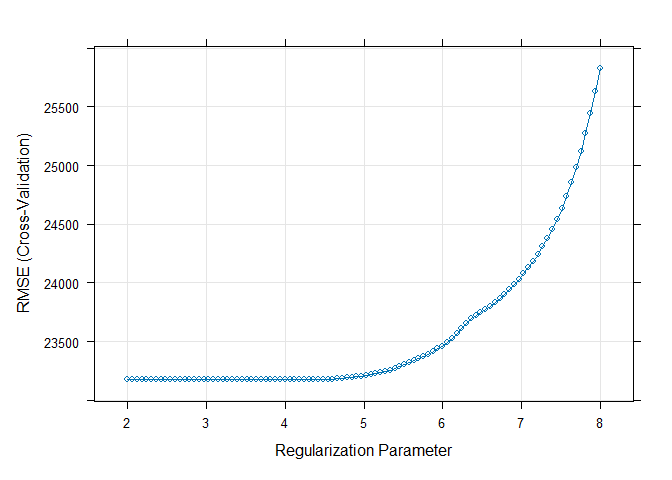
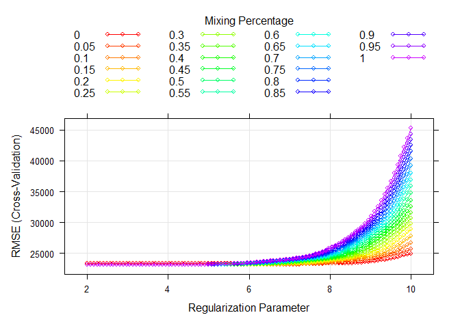
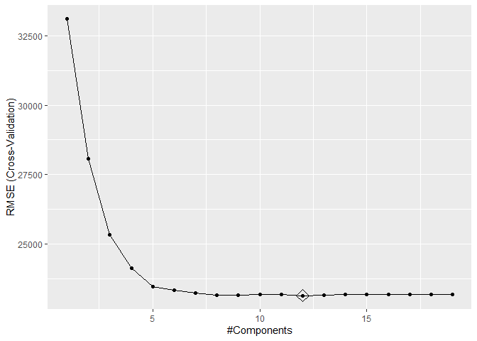
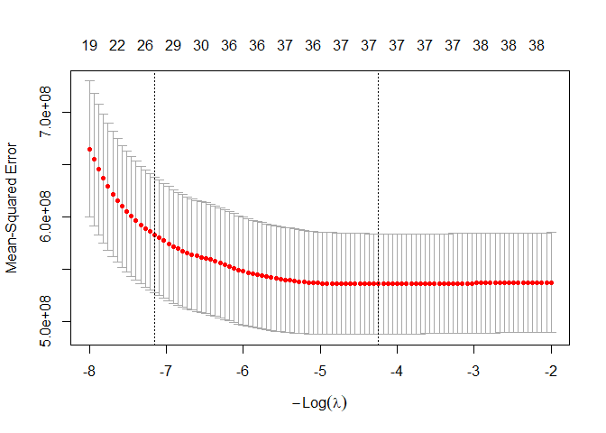

DS HW1
================
Ruihan Ding
2026-02-25

``` r
library(ISLR)
library(glmnet)
library(caret)
library(tidymodels)
library(corrplot)
library(ggplot2)
library(plotmo)
library(ggrepel)
library(tidyverse)
library(pls)
```

Import the data.

``` r
housing_train = 
  read_csv("housing_training.csv") |> 
  janitor::clean_names()
```

    ## Rows: 1440 Columns: 26
    ## ── Column specification ────────────────────────────────────────────────────────
    ## Delimiter: ","
    ## chr  (4): Overall_Qual, Kitchen_Qual, Fireplace_Qu, Exter_Qual
    ## dbl (22): Gr_Liv_Area, First_Flr_SF, Second_Flr_SF, Total_Bsmt_SF, Low_Qual_...
    ## 
    ## ℹ Use `spec()` to retrieve the full column specification for this data.
    ## ℹ Specify the column types or set `show_col_types = FALSE` to quiet this message.

``` r
housing_test = 
  read_csv("housing_test.csv") |> 
  janitor::clean_names()
```

    ## Rows: 959 Columns: 26
    ## ── Column specification ────────────────────────────────────────────────────────
    ## Delimiter: ","
    ## chr  (4): Overall_Qual, Kitchen_Qual, Fireplace_Qu, Exter_Qual
    ## dbl (22): Gr_Liv_Area, First_Flr_SF, Second_Flr_SF, Total_Bsmt_SF, Low_Qual_...
    ## 
    ## ℹ Use `spec()` to retrieve the full column specification for this data.
    ## ℹ Specify the column types or set `show_col_types = FALSE` to quiet this message.

# a

- Fit a lasso model on the training data.

``` r
ctrl1 = trainControl(method = "cv", number = 10)

set.seed(2026)
lasso.fit = train(sale_price ~ .,
                  data = housing_train,
                  method = "glmnet",
                  tuneGrid = expand.grid(alpha = 1, 
                                         lambda = exp(seq(8, 2, length = 100))),
                  trControl = ctrl1)

plot(lasso.fit, xTrans = log)
```

<!-- -->

- Report the selected tuning parameter and the test error.

``` r
lasso_lambda_min = lasso.fit$bestTune$lambda

lasso.pred = predict(lasso.fit, newdata = housing_test)
lasso_test_mse = mean((lasso.pred - housing_test[["sale_price"]])^2)
```

*The selected lambda is 65.4848083, and the test error is
4.3996792^{8}.*

- When the 1SE rule is applied, how many predictors are included in the
  model?

``` r
ctrl_1se = trainControl(method = "cv",
                        number = 10,
                        selectionFunction = "oneSE")

set.seed(2026)
lasso_1se.fit = train(sale_price ~ .,
                      data = housing_train,
                      method = "glmnet",
                      tuneGrid = expand.grid(alpha = 1,
                                             lambda = exp(seq(8, 2, length = 100))),
                      trControl = ctrl_1se)

lasso_1se = lasso_1se.fit$bestTune$lambda
lasso_1se_coef = coef(lasso_1se.fit$finalModel, lasso_1se)
lasso_1se_coef
```

    ## 40 x 1 sparse Matrix of class "dgCMatrix"
    ##                               s=942.4519
    ## (Intercept)                -1.708349e+06
    ## gr_liv_area                 5.568317e+01
    ## first_flr_sf                1.178647e+00
    ## second_flr_sf               .           
    ## total_bsmt_sf               3.675124e+01
    ## low_qual_fin_sf            -2.390210e+01
    ## wood_deck_sf                8.085711e+00
    ## open_porch_sf               7.140424e+00
    ## bsmt_unf_sf                -1.899986e+01
    ## mas_vnr_area                1.436778e+01
    ## garage_cars                 3.087641e+03
    ## garage_area                 1.159899e+01
    ## year_built                  3.169102e+02
    ## tot_rms_abv_grd            -8.706872e+02
    ## full_bath                   .           
    ## overall_qualAverage        -2.900389e+03
    ## overall_qualBelow_Average  -8.672363e+03
    ## overall_qualExcellent       8.933970e+04
    ## overall_qualFair           -5.488845e+03
    ## overall_qualGood            9.437591e+03
    ## overall_qualVery_Excellent  1.587474e+05
    ## overall_qualVery_Good       3.558537e+04
    ## kitchen_qualFair           -4.549109e+03
    ## kitchen_qualGood            .           
    ## kitchen_qualTypical        -9.766031e+03
    ## fireplaces                  6.635631e+03
    ## fireplace_quFair            .           
    ## fireplace_quGood            4.494381e+03
    ## fireplace_quNo_Fireplace    .           
    ## fireplace_quPoor            .           
    ## fireplace_quTypical         .           
    ## exter_qualFair             -1.387356e+04
    ## exter_qualGood              .           
    ## exter_qualTypical          -5.269069e+03
    ## lot_frontage                6.524291e+01
    ## lot_area                    5.461956e-01
    ## longitude                  -6.992835e+03
    ## latitude                    1.127163e+04
    ## misc_val                    .           
    ## year_sold                   .

*Under the 1SE rule, the model includes 29 predictors.*

# b

- Fit an elastic net model on the training data.

``` r
set.seed(2026)
enet.fit = train(sale_price ~ .,
                 data = housing_train,
                 method = "glmnet",
                 tuneGrid = expand.grid(alpha = seq(0, 1, length = 21),
                                        lambda = exp(seq(10, 2, length = 100))),
                 trControl = ctrl1)

myCol = rainbow(25)
myPar = list(superpose.symbol = list(col = myCol),
             superpose.line = list(col = myCol))

plot(enet.fit, par.settings = myPar, xTrans = log)
```

<!-- -->

- Report the selected tuning parameters and the test error.

``` r
enet.fit$bestTune
```

    ##     alpha  lambda
    ## 156  0.05 629.197

``` r
enet_alpha = enet.fit$bestTune$alpha
enet_lambda_min = enet.fit$bestTune$lambda

enet.pred = predict(enet.fit, newdata = housing_test)
enet_test_mse = mean((enet.pred - housing_test[["sale_price"]])^2)
```

*The selected alpha is 0.05, lambda is 629.1970259, and the test error
is 4.381072^{8}.*

- Is it possible to apply the 1SE rule to select the tuning parameters
  for elastic net? If the 1SE rule is applicable, implement it to select
  the tuning parameters. If not, explain why.

``` r
set.seed(2026)
enet_1se.fit = train(sale_price ~ .,
                     data = housing_train,
                     method = "glmnet",
                     tuneGrid = expand.grid(alpha = enet_alpha,
                                            lambda = exp(seq(10, 2, length = 100))),
                     trControl = ctrl_1se)

enet_1se = enet_1se.fit$bestTune$lambda
```

*Based on the previously selected optimal alpha = 0.05, I applied the
1SE rule to determine lambda, which is 7105.9438067.*

# c

- Fit a partial least squares model on the training data and report the
  test error.

``` r
x = model.matrix(sale_price ~ ., housing_train)[, -1]
y = housing_train[["sale_price"]]

x2 = model.matrix(sale_price ~ ., housing_test)[, -1]
y2 = housing_test[["sale_price"]]

set.seed(2026)
pls_fit = train(x, y,
                method = "pls",
                tuneGrid = data.frame(ncomp = 1:19),
                trControl = ctrl1,
                preProcess = c("center", "scale"))

predy_pls = predict(pls_fit, newdata = x2)
pls_test_mse = mean((y2 - predy_pls)^2)
```

*The test error is 4.4962272^{8}.*

- How many components are included in your model?

``` r
ggplot(pls_fit, highlight = TRUE)
```

<!-- -->

*There are 12 components in my model.*

# d

- Choose the best model for predicting the response and explain your
  choice.

``` r
resamp = resamples(list(lasso = lasso.fit, lasso_1se = lasso_1se.fit, enet = enet.fit, enet_1se = enet_1se.fit, pls = pls_fit))

summary(resamp)
```

    ## 
    ## Call:
    ## summary.resamples(object = resamp)
    ## 
    ## Models: lasso, lasso_1se, enet, enet_1se, pls 
    ## Number of resamples: 10 
    ## 
    ## MAE 
    ##               Min.  1st Qu.   Median     Mean  3rd Qu.     Max. NA's
    ## lasso     14767.34 16239.16 16549.68 16668.63 17386.11 18238.66    0
    ## lasso_1se 15033.07 16138.48 16639.94 16885.36 17969.81 18574.42    0
    ## enet      14738.00 16197.92 16513.52 16639.35 17367.60 18182.56    0
    ## enet_1se  14874.30 16280.09 16636.11 16818.23 17745.68 18166.41    0
    ## pls       14893.35 16234.26 16664.76 16712.82 17444.65 18244.49    0
    ## 
    ## RMSE 
    ##               Min.  1st Qu.   Median     Mean  3rd Qu.     Max. NA's
    ## lasso     20061.98 21746.27 22975.06 23176.81 24580.80 28303.85    0
    ## lasso_1se 20664.02 21951.74 23537.46 23940.75 25205.61 30682.77    0
    ## enet      20039.62 21714.28 23015.51 23166.35 24604.52 28258.98    0
    ## enet_1se  20815.36 22069.64 23505.00 23900.49 24661.24 30952.67    0
    ## pls       20051.99 21777.34 23017.97 23145.53 24573.40 27804.33    0
    ## 
    ## Rsquared 
    ##                Min.   1st Qu.    Median      Mean   3rd Qu.      Max. NA's
    ## lasso     0.8705812 0.8851274 0.9075688 0.9016793 0.9169088 0.9263271    0
    ## lasso_1se 0.8667812 0.8758247 0.9030785 0.8954890 0.9098742 0.9258259    0
    ## enet      0.8707239 0.8849025 0.9075583 0.9018122 0.9167978 0.9261045    0
    ## enet_1se  0.8691088 0.8777841 0.9015654 0.8966101 0.9108552 0.9239632    0
    ## pls       0.8693941 0.8855808 0.9074139 0.9018073 0.9168251 0.9257025    0

*Partial least squares model is the best choice for predicting the
response, because it achieves the lowest cross-validated RMSE.*

# e

- If R package “caret” was used for the lasso in (a), retrain this model
  using R package “glmnet”, and vice versa. Compare the selected tuning
  parameters between the two software approaches. Should there be
  discrepancies in the chosen parameters, discuss potential reasons for
  these differences.

``` r
x = model.matrix(sale_price ~ ., housing_train)[,-1]
y = housing_train[["sale_price"]]

set.seed(2026)
cv.lasso = cv.glmnet(x, y, 
                     alpha = 1,
                     lambda = exp(seq(8, 2, length = 100)))
```

``` r
plot(cv.lasso)
```

<!-- -->

``` r
cv.lasso$lambda.min
```

    ## [1] 69.57632

``` r
predict(cv.lasso, s = "lambda.1se", type = "coefficients")
```

    ## 40 x 1 sparse Matrix of class "dgCMatrix"
    ##                               lambda.1se
    ## (Intercept)                -5.985566e+05
    ## gr_liv_area                 5.345124e+01
    ## first_flr_sf                1.395202e+00
    ## second_flr_sf               .           
    ## total_bsmt_sf               3.661138e+01
    ## low_qual_fin_sf            -1.728760e+01
    ## wood_deck_sf                7.418817e+00
    ## open_porch_sf               5.075802e+00
    ## bsmt_unf_sf                -1.763644e+01
    ## mas_vnr_area                1.463194e+01
    ## garage_cars                 3.275265e+03
    ## garage_area                 1.198837e+01
    ## year_built                  3.255182e+02
    ## tot_rms_abv_grd             .           
    ## full_bath                   .           
    ## overall_qualAverage        -2.385355e+03
    ## overall_qualBelow_Average  -7.499860e+03
    ## overall_qualExcellent       8.668954e+04
    ## overall_qualFair           -3.321366e+03
    ## overall_qualGood            8.238395e+03
    ## overall_qualVery_Excellent  1.546285e+05
    ## overall_qualVery_Good       3.395035e+04
    ## kitchen_qualFair           -2.644824e+03
    ## kitchen_qualGood            .           
    ## kitchen_qualTypical        -9.956713e+03
    ## fireplaces                  7.110463e+03
    ## fireplace_quFair            .           
    ## fireplace_quGood            3.846354e+03
    ## fireplace_quNo_Fireplace    .           
    ## fireplace_quPoor            .           
    ## fireplace_quTypical         .           
    ## exter_qualFair             -1.226437e+04
    ## exter_qualGood              .           
    ## exter_qualTypical          -5.765815e+03
    ## lot_frontage                5.205945e+01
    ## lot_area                    5.098712e-01
    ## longitude                   .           
    ## latitude                    .           
    ## misc_val                    .           
    ## year_sold                   .
